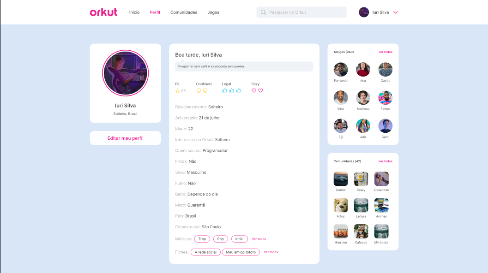

# 🧠 Orkut Clone - Desafio CodeLab

 <!-- Substitua pelo caminho real da imagem -->

Este projeto é uma **réplica do Orkut**, desenvolvida como parte de um desafio proposto pela **CodeLab**. O objetivo é colocar em prática conhecimentos de front-end moderno recriando uma das redes sociais mais nostálgicas da internet!

---

## 🚀 Tecnologias Utilizadas

- [Vue.js](https://vuejs.org/) - Framework JavaScript progressivo
- [Sass](https://sass-lang.com/) - Pré-processador CSS para estilização avançada

---

## ⚙️ Status do Projeto

🚧 **Em construção**  
Este projeto está em desenvolvimento ativo e **recebe atualizações diárias**.

---

## 📂 Como rodar o projeto

```bash
# Instale as dependências
npm install

# Rode o projeto
npm run dev

# Acesse via navegador
http://localhost:5173
